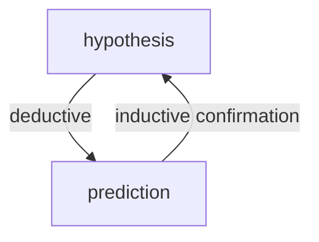

The aim of [[logical-empiricism]] was to develop a logical theory of evidence in science. **Confirmation** of theories is understood to be the logical support evidence provides to hypotheses.

Key problems associated with confirmation =
1. [[Hume-on-the-problem-of-induction|problem-of-induction]] = David Hume noted that there is no logical justification for assuming that future events will resemble past experience 
2. [[the-Raven's-problem]]
3. [[Goodman-new-riddle-of-induction]]
#### Deductive vs. Inductive logic

Two kinds of inference:
1. **Deductive inference** = inference in which the conclusion must be true if the premises are true
	- patterns of arguments that transmit truth with certainty
2. **Inductive inference** = inference in which the truth of the premises do not guarantee the truth of the conclusion
	- **induction** = inferences that go from particular observations to generalizations
	- **projection** = inferring a prediction about the next case from a number of observed cases
	- **explanatory induction** (also known as [[Foster-proposed-solution-to-the-problem-of-induction|inference-to-the-best-explanation]]) = inferring a hypothesis about a structure or event that would explain the observations

Deductive inferences repurposes the information already contained in the premises, so that it doesn't say anything over and above the information that was already there. Deductive inferences, hence, are not typically used to draw conclusions about unobserved cases on the basis of observed cases. 

Inductive arguments are supposed to provide their conclusions with some measure of probability.

| Induction                                                                                                                                                          | Deduction                                                                           |
| ------------------------------------------------------------------------------------------------------------------------------------------------------------------ | ----------------------------------------------------------------------------------- |
| Swan 1 observed at $t_1$ was white Swan 2 observed at $t_2$ was white . . .  Swan 1000 observed at $t_{1000}$ was white Therefore, all swans are white | Swan 1 observed at $t_1$ was white Therefore, Swan 1 observed at $t_1$ was white |
| $a_1$ is an F and also a G $a_2$ is an F and also a G Therefore, all F's are G's                                                                             | All F's are G's a is an F Therefore, a is a G                                 |

According to logical empiricists, inferences from observational statements that make up a theory to support the generalizations of theoretical claims are always non-deductive. In fact, there is hardly any reasoning about the world in everyday life and science that carries the kinds of guarantee found in deductive logic, as for logical empiricists, science could never reach absolute certainty. Their aim was not to show that scientific theories could be proven, instead the aim was to given an account of the relationships between the theoretical claims and the observation statements.

For most logical empiricists, induction was seen as fundamental or at the very least, a model for all other kinds of non-deductive logic. 
#### Hypothetico-Deductivisim
It is a model of scientific reasoning where theories are tested by deducing observable predictions from them; if the predictions are true in experiment, the theory is supported. This is an alternative to pure induction focusing on hypothesis testing rather than gaining facts.

- The prediction of an observation is *deduced* from the hypothesis. 
- The hypothesis is confirmed by the (correct) observation. i.e., verification of the observation lends inductive support to the hypothesis. It does not guarantee the truth of the hypothesis, but it makes it more likely that the hypothesis is true

Steps =
1. hypothesis formed
2. observational predictions deduced from hypothesis
3. observation and experiment
4. hypothesis confirmed (to some degree) by correct prediction